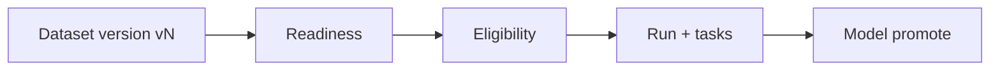
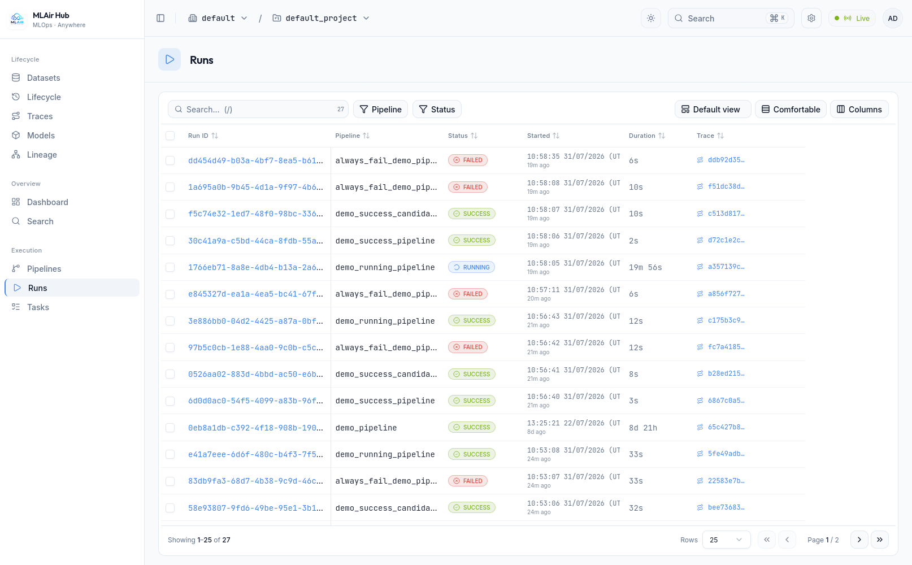
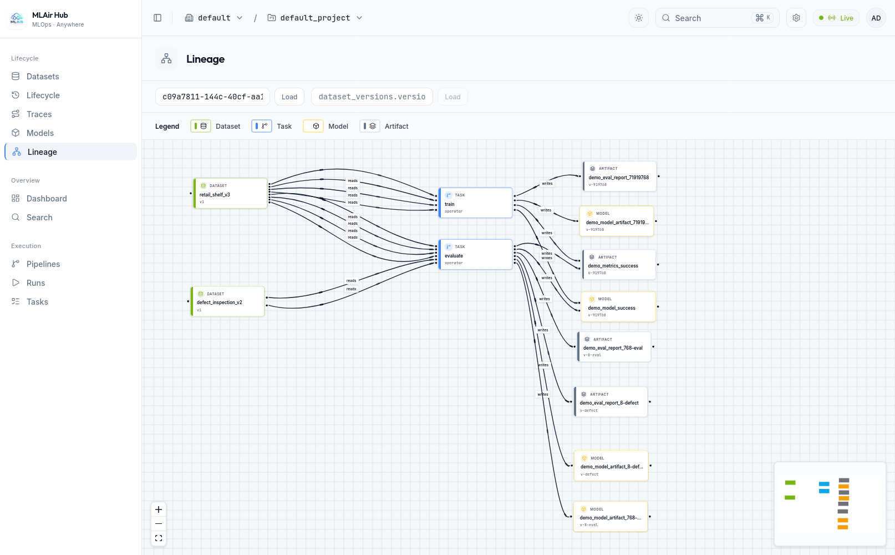
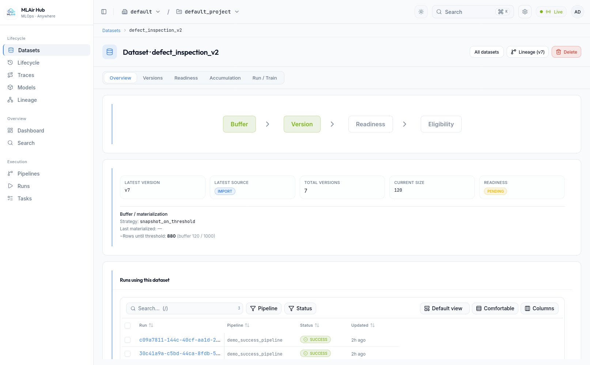
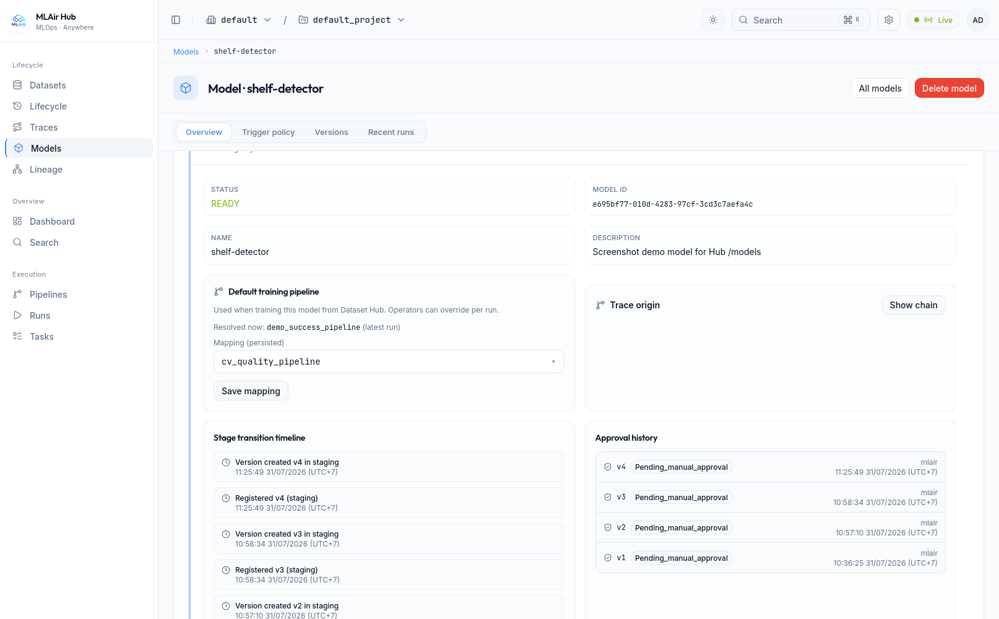

<p align="center">
  
</p>

<h1 align="center">MLAir</h1>

<p align="center">
  <strong>Lifecycle operating system for ML</strong> — immutable dataset versions, policy-backed readiness, gated runs, and model promotion.
</p>

<p align="center">
  <a href="https://github.com/phu142857/ml-air/actions/workflows/ci.yml"></a>
  <a href="LICENSE"></a>
  <a href="https://github.com/phu142857/ml-air/pkgs/container/ml-air"></a>
  <a href="docs/index.md"></a>
</p>

<p align="center">
  <a href="docs/index.md">Docs</a> ·
  <a href="docs/getting-started/quickstart.md">Quickstart</a> ·
  <a href="ARCHITECTURE.md">Architecture</a> ·
  <a href="CHANGELOG.md">Changelog</a> ·
  <a href="CONTRIBUTING.md">Contributing</a>
</p>

---

MLAir is a **governance-centric control plane** for training: pin an immutable **dataset version**, evaluate **readiness**, trigger a **gated run**, and **promote** a model — with pipelines as the execution substrate (DAG, retries, replay), not the product story.

Orchestration and tracking live inside one **`run_id`**, version pin, and audit trail. It is **not** a drop-in replacement for Airflow or MLflow; it owns lifecycle metadata, auth scope, and audit while your app and plugins own business logic.



**Operator path:** Dataset Hub → **Run / Train** → Hub Runs / lineage.  
**Maintainer path:** Execution nav (pipelines, runs, tasks) for observability.

### Hub at a glance

<p align="center">
  
</p>
<p align="center"><em>Runs — filterable execution list with SUCCESS, FAILED, and RUNNING</em></p>

<p align="center">
  
</p>
<p align="center"><em>Lineage — dataset → task → model / artifact graph</em></p>

<p align="center">
  
</p>
<p align="center"><em>Dataset Hub — versions, readiness, and runs on a pinned snapshot</em></p>

<p align="center">
  
</p>
<p align="center"><em>Models — registry overview, stage timeline, and approvals</em></p>

---

## Get started in 3 steps

**Prerequisites:** Docker with Compose v2.

```bash
git clone https://github.com/phu142857/ml-air.git
cd ml-air
pip install -e .
```

```bash
mlair doctor
mlair build && mlair start    # or: MLAIR_IMAGE=ghcr.io/phu142857/ml-air:v1.0.0 mlair start --pull
mlair health
```

Open **http://localhost:8080/login** and sign in with the bootstrap admin from `.env.example` (`admin` / `admin-change-me` by default). Change the password under **My Account → Security**, then enable MFA.

```bash
# After login (or with a PAT from My Account → CLI & API):
export TOKEN="<access_token_or_pat>"
curl -sS -H "Authorization: Bearer $TOKEN" http://localhost:8080/v1/auth/me
curl -sS http://localhost:8080/health
```

One container on **port 8080** serves Hub UI, REST `/v1`, and realtime `/ws`. Full install options: [Installation](docs/getting-started/installation.md). Configuration: [docs/configuration.md](docs/configuration.md).

---

## Capabilities

| Area | What you get |
| --- | --- |
| **Dataset Hub** | Immutable versions, accumulation strategies, Run / Train with pinned `dataset_version_id` |
| **Readiness & gates** | Training policies, eligibility, blocked reasons, strict version pinning |
| **Orchestration** | Pipelines, retries, DLQ / partial replay, internal or external workers |
| **Model governance** | Registry, approval, promote/rollback, Domain Audit on lifecycle |
| **Domain Events** | Aggregate-owned events → Audit, metrics, Timeline projection (Outbox-ready) |
| **Identity & security** | Login, MFA (TOTP + recovery), PATs, sessions, RBAC, service accounts |
| **Observability** | Traces, Prometheus/Grafana, Domain Audit API, audit timeline, Hub realtime |

Hub routes include `/datasets`, `/lifecycle`, `/models`, `/lineage`, `/runs`, `/settings/*`, and `/identity/*`. See [Hub lifecycle-first UX](docs/guides/hub-lifecycle-first.md) and [Login and Identity](docs/guides/login-and-identity.md).

---

## Architecture (short)

| Component | Role |
| --- | --- |
| **api** | FastAPI control plane (`/v1`): auth, datasets, readiness, runs, models, Domain Audit, plugins, lineage |
| **scheduler** | DAG planning, parallelism, replay gating via Redis |
| **executor** | Task workers (plugins / leases) |
| **frontend** | Next.js Hub |
| **PostgreSQL / Redis** | System of record and queues |
| **realtime** | WebSocket fanout for Hub sync |

**Data flow:** Client → API creates **Run** → scheduler enqueues **Tasks** → executor completes → Hub reflects status, metrics, lineage.

**Domain Event path:** Aggregate mutation → persist → `publish_all` → Audit / Metrics / Webhook handlers; Timeline reads Domain Audit. Details: [docs/architecture/](docs/architecture/README.md).

Deep topology and production baseline: **[ARCHITECTURE.md](ARCHITECTURE.md)**. API draft: [openapi-v1-draft.yaml](openapi-v1-draft.yaml). Narrative API docs: [docs/api/](docs/api/).

---

## Plugins

Extend steps via Python entry points (`mlair.plugins`) or HTTP tasks. Package, validate, reload — without reading orchestrator internals.

- [Plugin development guide](docs/plugin-development-guide.md)
- [Create a Plugin](docs/guides/create-plugin.md)
- [External worker execution](docs/guides/external-worker-execution.md)

---

## Deploy

| Path | Start here |
| --- | --- |
| Local / demo | `mlair start` or [quickstart](docs/getting-started/quickstart.md) |
| All-in-one image | `ghcr.io/phu142857/ml-air:<tag>` |
| Kubernetes | [charts/ml-air](charts/ml-air/README.md) |
| Production | [docs/runbooks/production-deployment.md](docs/runbooks/production-deployment.md) |

Observability assets live under `deploy/monitoring/` (Prometheus + Grafana). Guides: [Set Up Prometheus](docs/guides/setup-prometheus.md), [Debugging](docs/guides/debugging.md).

---

## Project layout

```
ml-air/
├── api/           # FastAPI + Alembic
├── scheduler/     # DAG scheduling
├── executor/      # Task workers
├── frontend/      # Next.js Hub
├── realtime/      # WebSocket sync
├── sdk/           # Client / tracking helpers
├── deploy/        # Compose + monitoring
├── charts/ml-air/ # Helm
├── docs/          # Guides & API reference
└── ARCHITECTURE.md
```

---

## Contributing

See [CONTRIBUTING.md](CONTRIBUTING.md). Maintainer bar before release: `mlair rebuild` (or quickstart) then `make test-all`; keep `.env` / `.env.example` in sync (`make test-env-sync`).

Shipped capabilities and notable changes: [CHANGELOG.md](CHANGELOG.md). Full doc index: [docs/index.md](docs/index.md).

---

## License

Released under the **MIT License** — see [LICENSE](LICENSE).
