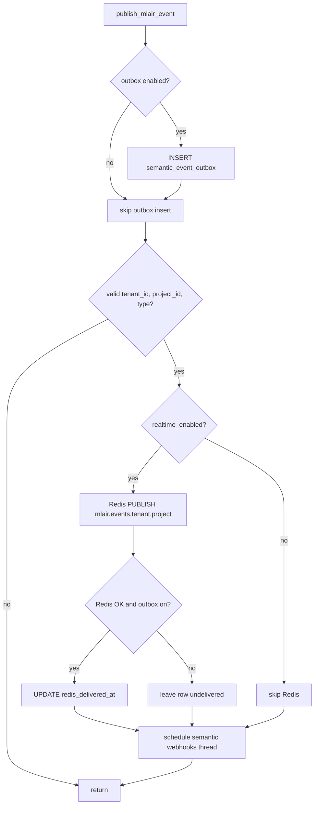
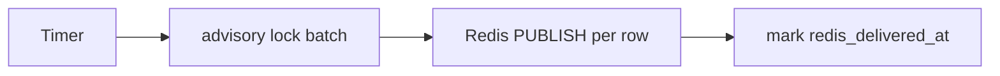
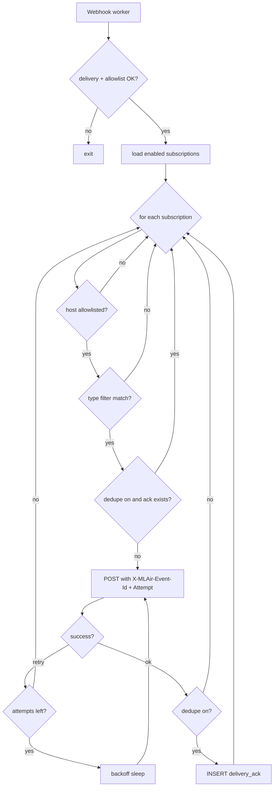
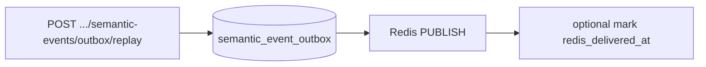
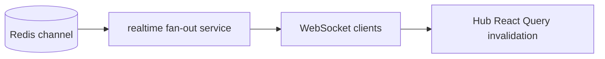

# Lifecycle semantic event flow

This page diagrams how **v1 semantic envelopes** move from the API to consumers: **Redis Pub/Sub** (UI realtime), optional **Postgres outbox**, optional **HTTP webhooks**, and **manual replay**.

**Contract:** [Realtime event envelope (v1)](../api/realtime-event-envelope.md).

## Publish path (API)

When application code calls `publish_mlair_event` ([`realtime_events.py`](../../api/app/services/realtime_events.py)), the API performs the following in one call (simplified).

**Notes**

- **Outbox** is best-effort insert; **Redis delivery mark** runs only after a **successful** publish when outbox is enabled.
- **Semantic webhooks** run in a **daemon thread** after validation, regardless of Redis success or failure (so automations can still receive events if Redis is down). Webhook HTTP itself is gated by `ML_AIR_SEMANTIC_WEBHOOK_DELIVERY` inside the worker.

## Optional outbox drain (API background)

When `ML_AIR_EVENT_OUTBOX_DRAIN_INTERVAL_SEC` > 0, a periodic thread republishes undelivered rows to Redis (advisory lock + `FOR UPDATE SKIP LOCKED`). See [Durable outbox](../api/realtime-event-envelope.md#durable-outbox-optional).

## Semantic webhook delivery (worker thread)

Per matching subscription, the worker may **skip** (dedupe), then **POST with retries**, then **record ack** (if dedupe is on).

## Manual replay (operator API)

Maintainers can re-push stored envelopes to **Redis** only (not a second outbox insert). See [Outbox listing and manual replay](../api/realtime-event-envelope.md#outbox-listing-and-manual-replay-operator).

## UI and external consumers (after Redis)

## Related guides

- [Reference: external integration surfaces](../guides/reference-integrations.md) — choose Redis vs webhooks vs audit vs metrics.
- [Semantic event webhook cookbook](../guides/semantic-webhook-cookbook.md) — register HTTP targets and verify signatures.
- [Runbook: Realtime / WebSocket service](../runbooks/realtime-service.md) — operate the fan-out path.
