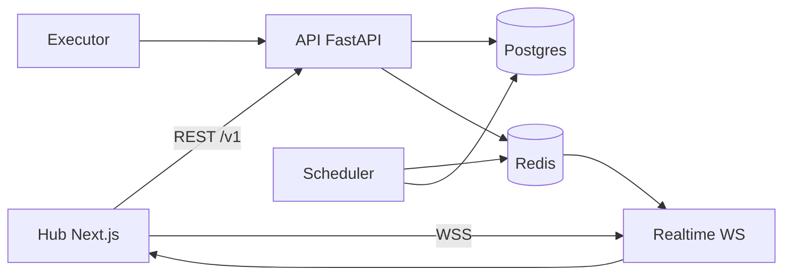

# Lifecycle formal model (MVP)

Engineering contract derived from shipped MLAir behavior. **Not** a machine-checked proof; use for reviews, onboarding, and Phase 9 alignment.

**Related:** [State machines](./lifecycle-state-machines.md) · [Event envelope](../api/realtime-event-envelope.md) · [Readiness & gating](../api/readiness-and-gating.md)

## Entities

| Symbol | Domain | Persistent store |
| --- | --- | --- |
| `D` | Dataset (logical name per tenant/project) | `datasets` |
| `V` | Dataset version (immutable snapshot) | `dataset_versions` |
| `B` | Accumulation buffer | `dataset_buffers` |
| `P` | Readiness policy | policy config + eval rows |
| `R` | Readiness evaluation | `dataset_readiness_evaluations` |
| `M` | Model | `models` |
| `MV` | Model version | `model_versions` |
| `Run` | Execution run | `runs` |
| `Task` | DAG task instance | `tasks` |

## Invariants (selected)

1. **Version monotonicity:** For dataset `D`, version labels are `v1, v2, …` without reuse ([`lineage_service`](../../api/app/domains/lifecycle/lineage_service.py)).
2. **Snapshot immutability:** `(checksum, record_count, uri)` for `V` are not mutated after create; only additive metadata (`tags`, `external_refs`).
3. **Pinned evaluation:** When `ML_AIR_READINESS_ALLOW_LEGACY_FALLBACK=0`, readiness/eligibility APIs require explicit `dataset_version_id` if versions exist.
4. **Materialization atomicity:** Buffer reset and version insert commit in one DB transaction.
5. **Idempotent materialization:** Same `(dataset_id, window, checksum, strategy)` does not create duplicate versions.
6. **Scope isolation:** All mutations are scoped by `(tenant_id, project_id)`; RBAC via `authorize_scope`.

## State transitions (summary)

| Entity | States (coarse) | Typical events |
| --- | --- | --- |
| `V` | `pending` → `ready` / `blocked` (quality) | upload, materialize |
| `R` | derived from policy + `V` | `POST .../readiness/evaluate` |
| `Run` | `PENDING` → `RUNNING` → `SUCCESS` \| `FAILED` | scheduler, executor |
| `MV` | stage + `approval_status` | promote, approval PUT |

See [lifecycle-state-machines.md](./lifecycle-state-machines.md) for diagrams.

## Lifecycle algebra (operational)

Pure functions as implemented today (not symbolic math):

```
readiness(V, P) → { ready: bool, reasons[], canonical_code, … }
  Implemented: readiness_service.evaluate_* 

eligibility(D, MV?, policy?) → { eligible_models[], blocked_models[], reasons[] }
  Implemented: readiness_service + governance checks on GET .../eligibility

δ(scope_state, event) → scope_state'
  Implemented: event handlers in lineage_service, run_service, model_registry_service,
                plus publish_mlair_event → Redis → Hub invalidation
```

**Execution gate** (train/run): `blocked_by_gate` on `training.triggered` when readiness/eligibility fails at trigger time.

## Event semantics (closed set v1)

Canonical types are enumerated in [`realtime_events.py`](../../api/app/domains/lifecycle/realtime_events.py) and [realtime-event-envelope.md](../api/realtime-event-envelope.md).

| Guarantee | Description |
| --- | --- |
| **At-least-once publish** | Redis pub/sub; consumers dedupe on `event_id` / `sequence` |
| **Ordering (soft)** | Per-scope `sequence` monotonic when Redis available |
| **Preconditions** | Emitters check tenant/project + resource existence before publish |
| **Side effects** | DB commit before or with publish; Hub invalidates on `type` map |
| **Persistence** | Optional outbox (`ML_AIR_EVENT_OUTBOX`); audit timeline for readiness/promote |

Formal proofs and full observability algebra: **deferred** (Phase 9 research backlog). **Partial machine check:** event `type` enum ↔ JSON Schema — [`api/tests/test_semantic_event_type_schema_parity.py`](../../api/tests/test_semantic_event_type_schema_parity.py). **Semantic observability MVP:** [`semantic_observability_model.py`](../../api/app/domains/observability/semantic_observability_model.py).

## Architecture diagram (logical)


