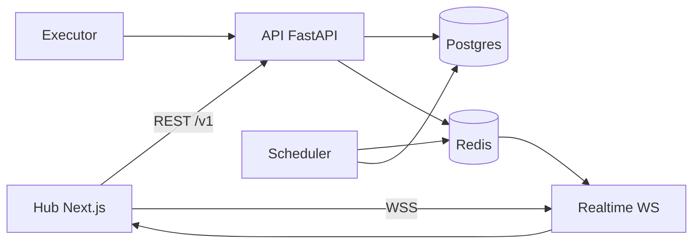

# Lifecycle formal model (MVP)

Engineering contract derived from shipped MLAir behavior. Use for reviews and onboarding.

**Related:** [State machines](./lifecycle-state-machines.md) · [Event envelope](../api/realtime-event-envelope.md) · [Readiness & gating](../api/readiness-and-gating.md)

## Entities

Each entity maps to at least one API field (response body / query param) and a DB column, so reviewers can trace a symbol from spec → HTTP surface → storage.

| Symbol | Domain | API field (≥1) | Persistent store (column) |
| --- | --- | --- | --- |
| `D` | Dataset (logical name per tenant/project) | `dataset_id`, `name` (`GET .../datasets`) | `datasets.id`, `datasets.name` |
| `V` | Dataset version (immutable snapshot) | `dataset_version_id`, `version`, `checksum`, `record_count` (`GET .../datasets/{id}/versions`) | `dataset_versions.id`, `dataset_versions.version` |
| `B` | Accumulation buffer | `current_size`, `target_threshold` (`GET .../datasets/{id}/buffer`) | `dataset_buffers.current_size`, `dataset_buffers.target_threshold` |
| `P` | Readiness / training policy | `policy_id`, `required_size` (`GET\|PUT .../training-policies`) | policy config JSON + eval rows |
| `R` | Readiness evaluation | `status`, `reasons[]`, `canonical_code` (`GET .../readiness`, `POST .../readiness/evaluate`) | `dataset_readiness_evaluations.status`, `.result` |
| `M` | Model | `model_id`, `name` (`GET .../models`) | `models.id`, `models.name` |
| `MV` | Model version | `version`, `stage`, `approval_status` (`GET .../models/{id}/versions`) | `model_versions.version`, `.stage`, `.approval_status` |
| `Run` | Execution run | `run_id`, `status`, `environment` (`GET .../runs/{id}`) | `runs.run_id`, `runs.status`, `runs.environment` |
| `Task` | DAG task instance | `task_id`, `status` (`GET .../runs/{id}/tasks`) | `tasks.task_id`, `tasks.status` |

## Invariants (selected)

1. **Version monotonicity:** For dataset `D`, version labels are `v1, v2, …` without reuse ([`lineage_service`](../../api/app/domains/lifecycle/lineage_service.py)).
2. **Snapshot immutability:** `(checksum, record_count, uri)` for `V` are not mutated after create; only additive metadata (`tags`, `external_refs`).
3. **Pinned evaluation:** When `ML_AIR_READINESS_ALLOW_LEGACY_FALLBACK=0`, readiness/eligibility APIs require explicit `dataset_version_id` if versions exist.
4. **Materialization atomicity:** Buffer reset and version insert commit in one DB transaction.
5. **Idempotent materialization:** Same `(dataset_id, window, checksum, strategy)` does not create duplicate versions.
6. **Scope isolation:** All mutations are scoped by `(tenant_id, project_id)`; RBAC via `authorize_scope`.

## State transitions (summary)

| Entity | States (coarse) | Typical events |
| --- | --- | --- |
| `V` | `pending` → `ready` / `blocked` (quality) | upload, materialize |
| `R` | derived from policy + `V` | `POST .../readiness/evaluate` |
| `Run` | `PENDING` → `RUNNING` → `SUCCESS` \| `FAILED` | scheduler, executor |
| `MV` | stage + `approval_status` | promote, approval PUT |

See [lifecycle-state-machines.md](./lifecycle-state-machines.md) for diagrams.

## Lifecycle algebra (operational)

Pure functions as implemented today (not symbolic math):

```
readiness(V, P) → { ready: bool, reasons[], canonical_code, … }
  Implemented: readiness_service.evaluate_* 

eligibility(D, MV?, policy?) → { eligible_models[], blocked_models[], reasons[] }
  Implemented: readiness_service + governance checks on GET .../eligibility

δ(scope_state, event) → scope_state'
  Implemented: event handlers in lineage_service, run_service, model_registry_service,
                plus publish_mlair_event → Redis → Hub invalidation
```

**Execution gate** (train/run): `blocked_by_gate` on `training.triggered` when readiness/eligibility fails at trigger time.

**Admission ternary (P1):** `explain_run_admission` and gated `POST .../runs` decide `ACCEPT | REJECT | DEFER` from policy/quota plus `ResourceState` (CPU/memory/GPU/task slots, tenant budget). REJECT is 4xx; DEFER is HTTP 202 + FIFO `admission_deferred` (scheduler flush). `GET .../admission/stats` exposes `deferred_ratio`.

**Evaluation harness (P2):** `python scripts/eval_harness.py` records API/admission p50–p99, scheduler tasks/sec, queue latency, worker-crash RTO, and observed usage vs harness `VmRSS`. See [evaluation harness](../guides/evaluation-harness.md).

## Event semantics (closed set v1)

Canonical types are enumerated in [`realtime_events.py`](../../api/app/domains/lifecycle/realtime_events.py) and [realtime-event-envelope.md](../api/realtime-event-envelope.md).

### Pre/post conditions per `EventType` (v1)

Every `EventType` in `realtime_events.py` has a row. **Common precondition** (enforced in `publish_mlair_event`): non-empty `tenant_id`, `project_id`, and `type`; optional signature when `event_signing_service.signing_enabled()`; schema validation when enabled. **Common postcondition:** best-effort outbox record → Redis pub/sub publish → `schedule_deliver_semantic_webhooks`. Rows below list the *emitter-specific* pre/post beyond the common contract.

| `EventType` | Emitter | Precondition (emitter-specific) | Postcondition (emitter-specific) |
| --- | --- | --- | --- |
| `run.created` | `emit_run_created` | Run row committed | Hub invalidates run list/detail |
| `run.updated` | `emit_run_updated` | Run status/columns changed | Hub invalidates run detail |
| `run.tracking.updated` | `emit_run_tracking_updated` | Task tracking (metrics/logs/artifacts) persisted | Hub polls tracking surfaces |
| `task.updated` | `emit_task_updated` | Task row status changed | Hub invalidates task list/detail |
| `model.promoted` | `emit_model_promoted` | Model version `stage` changed via promote | `mlair_lifecycle_model_promoted_total{stage}` inc |
| `model.eligibility.updated` | `emit_model_eligibility_updated` | Model governance/registry change affecting eligibility | Also emits `eligibility.updated{kind:model}` |
| `eligibility.updated` | `emit_model_eligibility_updated` / `emit_training_eligibility_updated` | Derived: emitted alongside model or training eligibility change | Hub invalidates eligibility surfaces |
| `dataset.updated` | `emit_dataset_updated` | Dataset row/metadata mutated | Hub invalidates dataset detail |
| `dataset.buffer.updated` | `emit_dataset_buffer_updated` | Buffer `current_size`/window changed on append | Hub invalidates buffer panel |
| `buffer.threshold_met` | `emit_buffer_threshold_met` | `current_size` first crosses `>= target_threshold` | `mlair_lifecycle_buffer_threshold_met_total{accumulation_strategy}` inc |
| `dataset.version.created` | `emit_dataset_version_created` | New immutable `V` committed (upload/materialize) | Hub invalidates version list |
| `dataset.readiness.updated` | `emit_dataset_readiness_updated` | Readiness recomputed (policy or size delta) | Hub invalidates readiness tab |
| `training.eligibility.updated` | `emit_training_eligibility_updated` | Eligibility evaluated at/around trigger | Also emits `eligibility.updated{kind:training}` |
| `training.policy.updated` | `emit_training_policy_updated` | Dataset training policy created/upserted | Hub cache invalidation |
| `training.triggered` | `emit_training_triggered` | Run row exists for Hub/intent train (gate may still block) | `mlair_lifecycle_training_triggered_total{blocked_by_gate,tenant_id}` inc |
| `training.completed` | `maybe_emit_training_completed_from_run_row` | Run `SUCCESS` **and** pinned `dataset_version_id` present | `mlair_lifecycle_training_completed_total` inc |

Machine-checked type ↔ schema parity: [`test_semantic_event_type_schema_parity.py`](../../api/tests/test_semantic_event_type_schema_parity.py).

| Guarantee | Description |
| --- | --- |
| **At-least-once publish** | Redis pub/sub; consumers dedupe on `event_id` / `sequence` |
| **Ordering (soft)** | Per-scope `sequence` monotonic when Redis available |
| **Preconditions** | Emitters check tenant/project + resource existence before publish |
| **Side effects** | DB commit before or with publish; Hub invalidates on `type` map |
| **Persistence** | Optional outbox (`ML_AIR_EVENT_OUTBOX`); audit timeline for readiness/promote |

**Machine checks:** event `type` enum ↔ JSON Schema — [`api/tests/test_semantic_event_type_schema_parity.py`](../../api/tests/test_semantic_event_type_schema_parity.py); readiness dedupe + immutable anchor defaults — [`api/tests/test_lifecycle_invariants.py`](../../api/tests/test_lifecycle_invariants.py). **Semantic observability index:** [`semantic_observability_model.py`](../../api/app/domains/observability/semantic_observability_model.py).

## Architecture diagram (logical)


