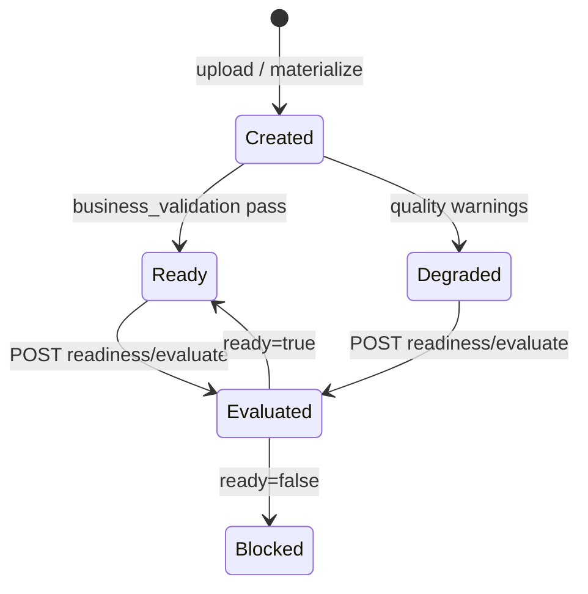
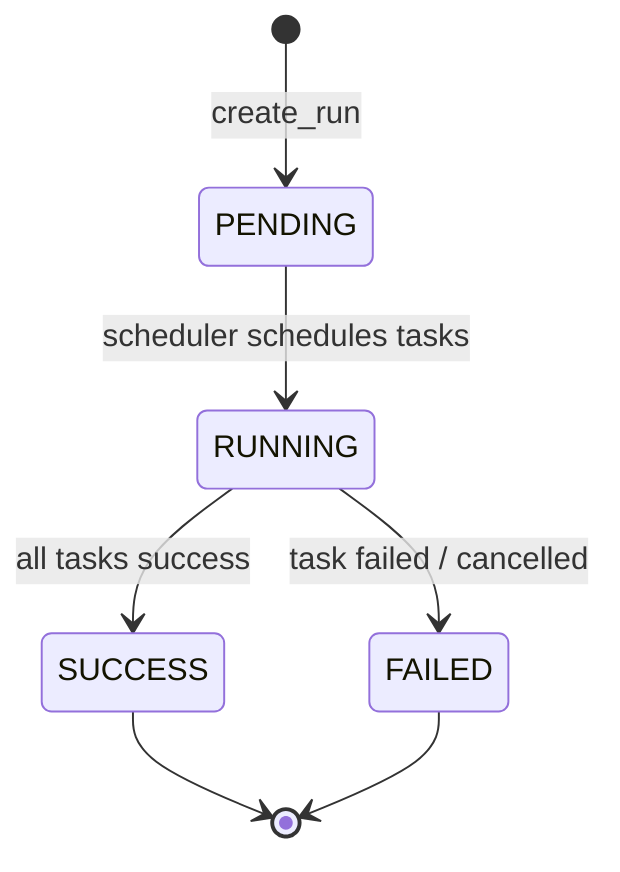
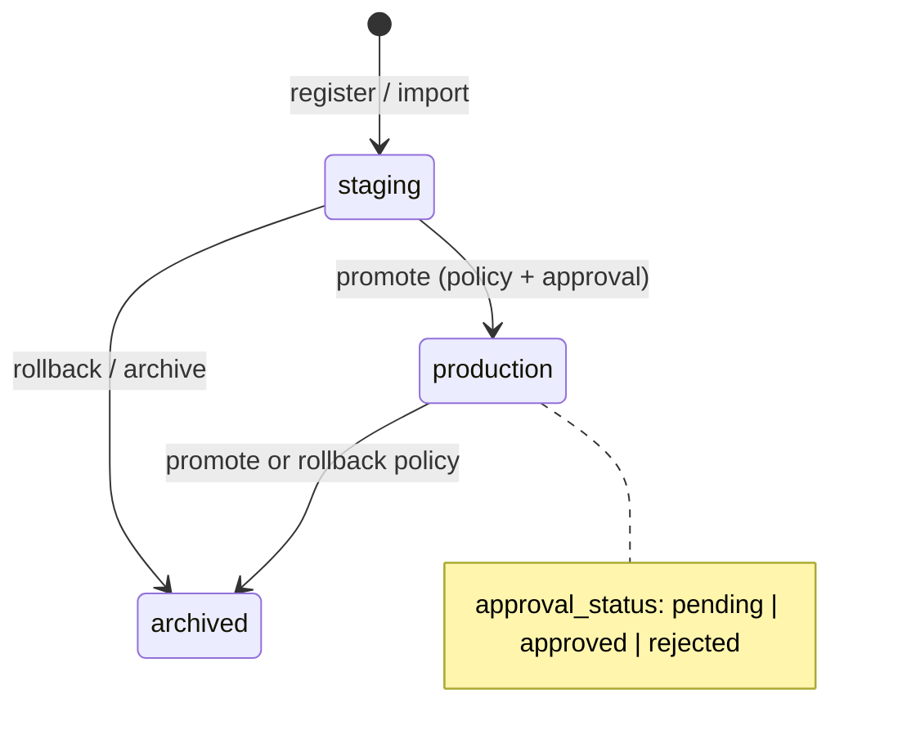
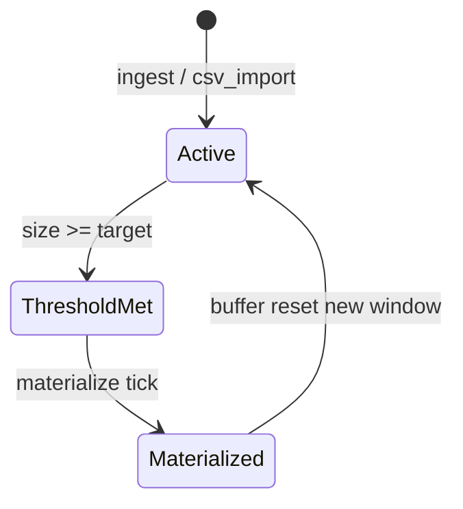

# Lifecycle state machines (MVP)

Coarse state machines matching shipped behavior. Use with [lifecycle-formal-model](./lifecycle-formal-model.md).

## Dataset version (quality / readiness surface)

Immutable fields after `Created` — see [dataset-version-immutability](../api/dataset-version-immutability.md).

## Run (execution)

Realtime: `run.created`, `run.updated`, `task.updated`, `training.completed` (on SUCCESS with pinned version).

## Model version (governance)

Promote transitions constrained by [`promotion_policy.py`](../../api/app/domains/governance/promotion_policy.py).

## Buffer → materialization

Event: `buffer.threshold_met`, `dataset.version.created`.
